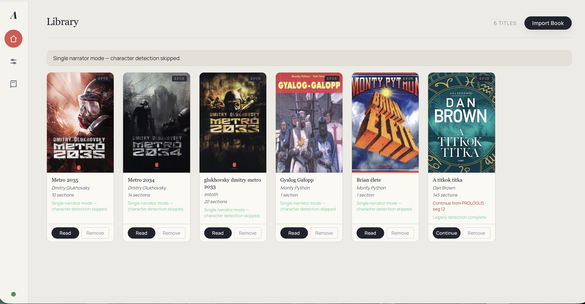
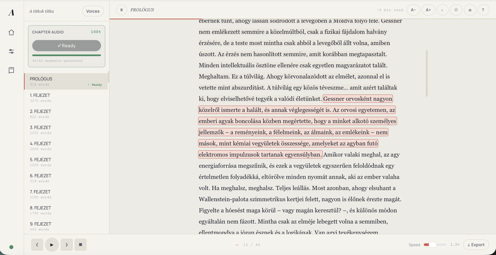
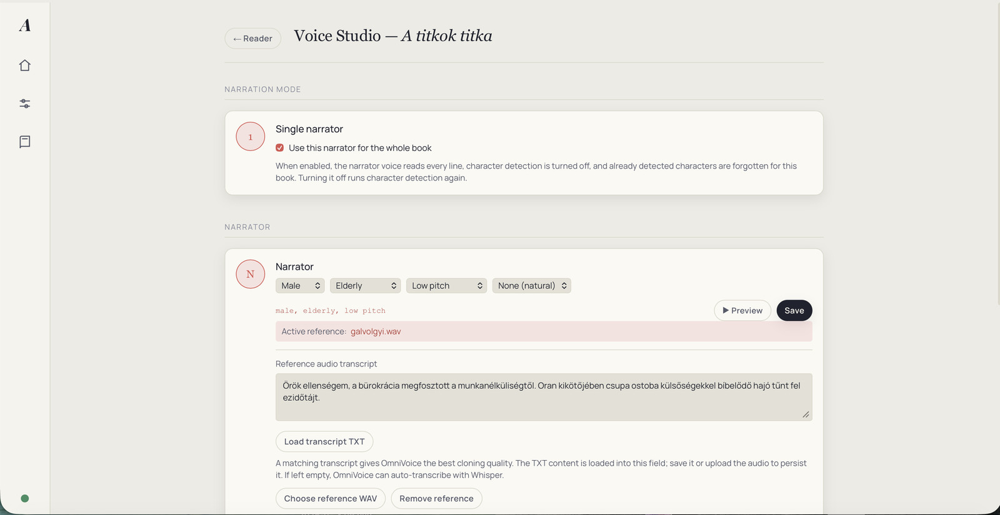
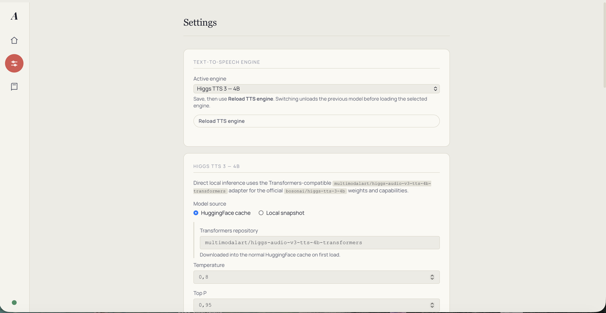

# Auris — lokális hangoskönyvkészítő (snokris-változat)

Teljesen **lokális, ingyenes hangoskönyvkészítő**: EPUB-, PDF- vagy TXT-könyvből felolvasott hangoskönyvet készít (WAV/MP3 + felirat), internetkapcsolat és API-kulcsok nélkül. Kiemelt **magyar nyelvi támogatással** — automatikus magyar nyelvfelismerés, „I. FEJEZET” típusú fejezetdetektálás, magyar párbeszédkezelés, hangklónozás magyar referenciahangból.

Ez a repó [mp3pintyo/Auris](https://github.com/mp3pintyo/Auris) forkja. Az eredeti projekt a szerző munkája és érdeme; ez a változat elsősorban **Apple Silicon (macOS) támogatással** és néhány saját minőségjavító funkcióval egészíti ki. Windows- és Linux-telepítéshez az eredeti repó útmutatója az irányadó.

## Képernyőképek

### Library


### Reader


### Voice Studio


### Settings


## Miben más ez a fork?

- **Apple Silicon (MPS) támogatás** — a TTS-motorok a Metal GPU-n futnak, nem CPU-n. Az OmniVoice float32-ben (a bfloat16 a mondatkezdeteket csípte le M-szérián), a Higgs a natív bfloat16-jában. Vészkapcsolók: `AURIS_MPS_DTYPE=bf16` (OmniVoice), `AURIS_HIGGS_MPS_DTYPE=fp32` (Higgs).
- **Whisper-illesztett szegmensvágás** — az összevontan generált hang szegmenshatárait szóidőbélyegek és dinamikus programozásos szóillesztés jelöli ki; a vágás a szavak közti szünetbe, nullátmenetre kerül, élsimítással. Ez megszünteti a lecsípett mondatvégeket, az áthallott szófoszlányokat és a határkattanásokat. A Settingsben választható a vágási mód és az illesztéshez használt Whisper-modell (alap: whisper-small).
- **Mentett narrátorhangok (Voice presets)** — a Voice Studióban a könyv referenciahangja (WAV + átirat) névvel elmenthető, és bármely könyvre egy kattintással alkalmazható.
- **Single narrator kártya** — a Voice Studio tetején kapcsolható az egynarrátoros mód: bekapcsolva a narrátor olvas mindent, a karakterdetektálás kikapcsol, a felismert szereplők törlődnek; kikapcsolva a detektálás automatikusan újrafut.
- **Akcentusválasztó bővítés** — „None (natural)” és „Hungarian” opció a hangleírásokban (magyar felolvasáshoz az akcentusjelölés nélküli leírás ajánlott).

## Telepítés macOS-en (Apple Silicon)

Előfeltétel a [Homebrew](https://brew.sh), utána:

```bash
brew install python@3.12 ffmpeg git
git clone https://github.com/snokris/Auris.git
cd Auris
python3.12 -m venv reader/.venv
bash reader/setup.sh
```

Indítás:

```bash
bash reader/run.sh
```

Ezután a böngészőben: **http://127.0.0.1:7860**

Első használatkor a Settings oldalon töltsd le az OmniVoice-modellt (~3 GB), és állítsd az exportformátumot MP3-ra. A modellek betöltésekor a Terminálban ellenőrizhető az eszköz: `on mps (torch.float32)` (OmniVoice), illetve `device=mps, dtype=torch.bfloat16` (Higgs).

## Használat röviden

1. **Library** — EPUB/PDF/TXT importálása (a magyar nyelvet magától felismeri).
2. **Reader** — lejátszás bármely mondattól; a fejezet hangja előre is legenerálható.
3. **Voice Studio** — narrátorhang beállítása leírással vagy klónozás referencia-WAV-ból (3–10 másodperces, tiszta, egybeszélős felvétel + pontos átirat); hangpresetek mentése és alkalmazása.
4. **Export** — fejezetek MP3-ba felirattal (`all`, `2-6` vagy `1,3,7-10` formában).

## TTS-motorok

| | OmniVoice (alapértelmezett) | Higgs TTS 3 — 4B |
|---|---|---|
| Magyar támogatás | igen (600+ nyelv) | igen, kiemelt |
| Erőssége | gyors, kis memóriaigény | kifejezőbb prozódia |
| Licenc | nyílt | kutatási/nem kereskedelmi* |

\* A Higgs licence hangoskönyveknél jól látható „Boson AI Higgs Audio” forrásmegjelölést kér, a hangklónozáshoz pedig a beszélő hozzájárulása szükséges. Részletek a [hivatalos modellkártyán](https://huggingface.co/bosonai/higgs-tts-3-4b).

## Hasznos beállítások (Settings)

- `Audio format` → **MP3** (az exporthoz ffmpeg szükséges)
- `tts_num_step` → 16 hallgatáshoz, 32 végleges exporthoz
- `Merge short lines` (coalesce) → 720 ajánlott; a szegmenshatárokat az illesztett vágás tartja tisztán
- `Split coalesced audio` → Aligned (ajánlott)
- `Alignment ASR model` → whisper-small (gyors) … whisper-large-v3-turbo (legpontosabb)
- Magyar könyvekhez: single narrator mód, vagy LLM-alapú karakterfelismerés lokális modellel (Ollama / LM Studio)

## Fejlesztési rend

A `dev` ág a mindig működő, összefésült állapot; minden téma saját `feature/<téma>` ágon készül, és tesztelés után olvad vissza. A változtatások visszakerülhetnek az eredeti projektbe is: az MPS-támogatás PR-ként beküldve ([mp3pintyo/Auris#1](https://github.com/mp3pintyo/Auris/pull/1)).

## Köszönet

Az alapprojektért köszönet **mp3pintyo**-nak, a TTS-motorokért a [k2-fsa/OmniVoice](https://github.com/k2-fsa/OmniVoice) és a [Boson AI](https://huggingface.co/bosonai) csapatának. A fork licence az eredeti projektét követi (lásd `LICENSE`).
